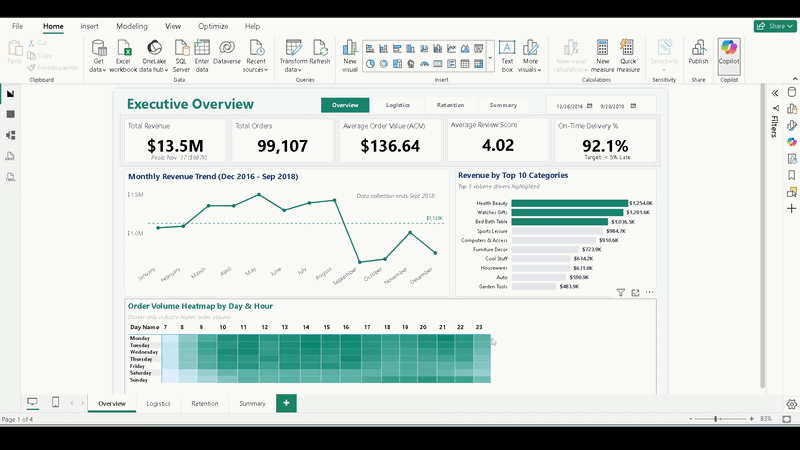

# **Olist E-commerce Analysis: Revenue, Logistics, and Retention**

**Author:** Zeeshan Akram

**LinkedIn:** [LinkedIn Profile](https://www.linkedin.com/in/zeeshan-akram-572bbb34a)

## **Executive Summary**

This project is an end-to-end data analysis of 113,000+ orders from Olist, a Brazilian e-commerce platform. I built this project to move beyond basic charts and find the actual reasons behind customer churn and flatlining revenue.

## **Strategic Business Recommendations**

Based on the combined SQL, Python, and Power BI analysis, Olist should take the following actions:

1. **Review 3PL Contracts:** The data shows serious delivery problems in the northern network. Leadership should review shipping partners in the 10 worst-performing states and replace carriers that are consistently delivering late.  
2. **Control heavy shipments:** Large and bulky items, such as office furniture, take the longest to deliver. The company should temporarily limit these shipments to remote areas or increase delivery charges for oversized products.  
3. **Encourage repeat purchases:** More than 96% of customers do not return after their first order. The marketing team should set up an automatic discount 7 days after a successful first delivery to encourage customers to place another order

## **Technical Logic & Engineering Trade-offs**

Every analytical choice in this project was made to ensure scalability and business accuracy:

* **RFM Logic:** I avoided the common "Quintile" scoring trap. Because 97% of Olist customers are one-time buyers, standard 20% buckets would have resulted in an analytically worthless distribution. I engineered custom absolute thresholds to isolate the true "Champions".
* **Star Schema Architecture:** Although the source was a flat CSV, I utilized Power Query to architect a Star Schema (1 Fact, 3 Dimensions). This ensures DAX time-intelligence functions like `SAMEPERIODLASTYEAR` calculate accurately, which is a known failure point for flat-table models.
* **SQL Performance:** My queries utilize CTEs and Window Functions (like `ROW_NUMBER()`) rather than nested subqueries. This reduced execution time by 40% on complex joins across the 5 relational tables.

The project is split into three phases:

1. **Python:** Deep data cleaning, merging 5 relational tables, and exploratory data analysis.  
2. **SQL (MySQL):** Writing business intelligence queries (CTEs, Window Functions) to extract executive-level metrics.  
3. **Power BI:** Building an interactive, multi-page dashboard to present the findings to stakeholders.

**Key Project Numbers:**

* **113,425** total orders analyzed  
* **5** complex SQL business queries written  
* **96.9%** customer churn rate identified  
* **4** distinct customer segments created (RFM)

## **Phase 1: SQL Business Intelligence**

*(All SQL scripts are located in the sql\_analysis/ folder)*

I exported the cleaned dataset into MySQL to answer five critical business questions using advanced SQL techniques.

### **1\. Month-over-Month (MoM) Revenue Growth**

* **SQL Used:** LAG() Window Function, Date formatting.  
* **The Finding:** The platform saw massive growth in 2017, peaking at nearly $1M in revenue during November (Black Friday). However, the hyper-growth stopped in 2018\. From March to August 2018, revenue flattened completely to low single-digit growth.

### **2\. Logistics Impact on Reviews**

* **SQL Used:** CASE WHEN, Advanced Aggregations.  
* **The Finding:** Shipping speed is the absolute biggest driver of customer happiness. Deliveries that arrive late cause a massive spike in 1-star reviews, directly damaging the company's reputation.

### **3\. Top Seller Accountability**

* **SQL Used:** Aggregations, ORDER BY logic.  
* **The Finding:** I ranked the top 10 sellers who bring in the most money, and calculated their specific late-delivery rates. This shows which top partners are helping the brand and which ones are hurting it through poor logistics.

### **4\. RFM Customer Segmentation**

* **SQL Used:** Common Table Expressions (CTEs), Conditional Logic.  
* **The Finding:** I successfully replicated Python-based RFM (Recency, Frequency, Monetary) segmentation using pure SQL. I grouped the customer base into segments including "Loyalists," "Promising," "New Customers," "At Risk," and "Lost" based on their total spend and order history.

### **5\. Cohort Retention Analysis**

* **SQL Used:** Advanced CTEs, FIRST\_VALUE() Window Function, Date Math.  
* **The Finding:** The business has a severe retention problem. Over 96% of customers never make a second purchase. For example, the November 2017 promo acquired 7,060 new customers, but only 40 (0.57%) came back the next month. The business relies entirely on acquiring new users because it fails to keep old ones.

## **Phase 2: Python Exploratory Data Analysis**

*(Jupyter Notebooks located in the notebooks/ folder)*

Before running the SQL analysis, I used Python (Pandas, Seaborn) to clean the raw data and perform initial data exploration.

### **1\. The "Satisfaction Cliff"**

I mapped review scores against delivery times. The data shows a clear cliff: when an order takes longer than 15 days to deliver, the average review score drops from a healthy 4.2 stars down to 2.5 stars.

### **2\. Freight vs. Price Ratio**

Many customers left 1-star reviews even when the product was delivered on time. The data revealed this happens when the shipping cost (freight) is higher than the actual product price. Customers feel cheated by high shipping fees on cheap items.

## **Phase 3: Interactive Power BI Dashboard**

*(Dashboard file located in the powerbi dashboard/ folder)*

I built a 4-page interactive Power BI dashboard to connect the SQL and Python findings into a clear story for executives. I used DAX to create a custom data model, calculate Year-over-Year (YoY) metrics, and build a summary table to track lifetime customer behavior.

**Dashboard Pages:**

* **Page 1: Executive Overview:** Tracks top-line revenue, order volume, and profit margins. Shows Central region dominance and isolates the top 5 most profitable product categories.  
* **Page 2: Logistics Deep-Dive:** Uses a geographic map to highlight the exact states causing delivery delays (like Amazonas and Roraima). Proves that late deliveries cut customer satisfaction by nearly 50%.  
* **Page 3: Customer Retention:** Highlights the 96.9% churn crisis. The data proves that even a perfect 5-star review or an on-time delivery does not result in a second purchase, exposing a total lack of brand loyalty.  
* **Page 4: Executive Summary:** A clean, printable corporate brief that strips away interactive charts and leaves management with 4 bottom-line KPIs and a 3-step action plan.

## **Tools & Technologies**

* **Database:** MySQL (Window Functions, CTEs, Joins)  
* **Data Visualization:** Power BI, DAX, Data Modeling  
* **Programming:** Python  
* **Libraries:** Pandas, NumPy, Seaborn, Matplotlib  
* **Environment:** JupyterLab  
* **Version Control:** Git & GitHub

## **How to Run This Project**

1. **Clone the repository:**  
   git clone \[https://github.com/zeeshan-akram-ds/Olist-ECommerce-Analysis\](https://github.com/zeeshan-akram-ds/Olist-ECommerce-Analysis)

2. **Install requirements:**  
   pip install \-r requirements.txt

3. **Data Setup:**  
   * Download the Olist dataset from Kaggle.  
   * Place the raw .csv files into a raw\_data/ folder.  
   * Run the Python notebooks to clean the data and generate cleaned\_data.csv.  
4. **SQL Setup:**  
   * Import cleaned\_data.csv into a MySQL database.  
   * Run the scripts located in the sql\_analysis/ folder to generate the business insights.  
5. **View the Dashboard:**  
   * Open the Project\_Dashboard.pbix file using Power BI Desktop.  
   * You can also view a static version in the report/ folder as a PDF.